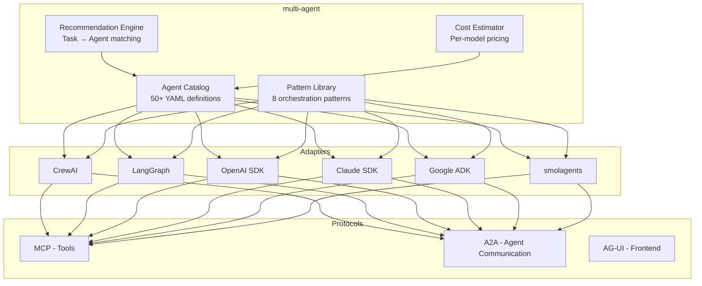

<p align="center">
  
</p>

<h1 align="center">multi-agent</h1>

<p align="center">
  <strong>The definitive catalog of AI agent patterns. One definition, any framework.</strong>
</p>

<p align="center">
  <a href="https://github.com/Hovborg/multi-agent/blob/main/LICENSE"></a>
  <a href="https://pypi.org/project/multi-agent/"></a>
  <a href="https://github.com/Hovborg/multi-agent/stargazers"></a>
  <a href="https://github.com/Hovborg/multi-agent/actions"></a>
  <a href="https://discord.gg/multiagent"></a>
</p>

<p align="center">
  <a href="#quick-start">Quick Start</a> &bull;
  <a href="#agent-catalog">Agent Catalog</a> &bull;
  <a href="#patterns">Patterns</a> &bull;
  <a href="#frameworks">Frameworks</a> &bull;
  <a href="docs/">Docs</a> &bull;
  <a href="CONTRIBUTING.md">Contributing</a>
</p>

---

**50+ battle-tested agent definitions. 8 orchestration patterns. 6 framework adapters. Zero lock-in.**

`multi-agent` is a framework-agnostic catalog of production-ready AI agent patterns. Define your agents once in YAML, run them on CrewAI, LangGraph, OpenAI Agents SDK, Claude SDK, Google ADK, or smolagents.

> *"57% of enterprise agent failures are orchestration failures, not model failures."* — Anthropic, 2026

Stop reinventing agents. Start composing them.

## Why multi-agent?

| | multi-agent | CrewAI | LangGraph | OpenAI SDK | Claude SDK |
|---|:---:|:---:|:---:|:---:|:---:|
| Framework-agnostic definitions | **Yes** | No | No | No | No |
| Agent catalog with 50+ roles | **Yes** | ~10 | ~5 | ~3 | ~5 |
| Pattern library (8 patterns) | **Yes** | 2 | 3 | 2 | 2 |
| Built-in cost estimation | **Yes** | No | No | No | No |
| Agent recommendation engine | **Yes** | No | No | No | No |
| Works with any LLM | **Yes** | Yes | Yes | OpenAI only | Claude only |
| MCP native | **Yes** | Partial | Adapter | Yes | Yes |
| Lines of core code | **~500** | 18K | 25K | 8K | 12K |

## Quick Start

```bash
pip install multi-agent
```

### 1. Browse the catalog

```bash
multiagent search "code review"
```

```
Found 3 agents matching "code review":

  code/code-reviewer     Review PRs for bugs, style, and security
  code/test-writer       Generate tests for changed code
  code/refactorer        Suggest and apply refactoring improvements

Recommended pattern: supervisor-worker (1 reviewer + N specialists)
Estimated cost: ~$0.03/review (Claude Haiku) to ~$0.25/review (GPT-4o)
```

### 2. Use an agent definition

```python
from multiagent import Catalog, patterns

# Load agents from the catalog
catalog = Catalog()
reviewer = catalog.load("code/code-reviewer")
test_writer = catalog.load("code/test-writer")

# Compose with a pattern
team = patterns.supervisor_worker(
    supervisor=reviewer,
    workers=[test_writer],
    model="claude-sonnet-4-6"  # or any model
)

result = team.run("Review this PR and write missing tests", context={
    "diff": open("changes.diff").read()
})
```

### 3. Or use with your favorite framework

```python
# CrewAI adapter
from multiagent.adapters import crewai
crew = crewai.from_catalog(["code/code-reviewer", "code/test-writer"])
result = crew.kickoff()

# LangGraph adapter
from multiagent.adapters import langgraph
graph = langgraph.from_catalog(["research/deep-researcher", "research/fact-checker"])
result = graph.invoke({"query": "Latest AI agent frameworks"})

# OpenAI Agents SDK adapter
from multiagent.adapters import openai_sdk
agent = openai_sdk.from_catalog("code/code-reviewer")
result = agent.run("Review this code")
```

## Agent Catalog

Every agent is defined in a simple, readable YAML format:

```yaml
# catalog/code/code-reviewer.yaml
name: code-reviewer
version: "1.0"
description: Reviews code changes for bugs, security issues, and style violations
category: code

system_prompt: |
  You are an expert code reviewer. Analyze the provided code changes and identify:
  1. Bugs and logic errors
  2. Security vulnerabilities (OWASP Top 10)
  3. Performance issues
  4. Style and readability improvements
  
  Be specific. Reference line numbers. Suggest fixes.

tools:
  - type: mcp
    server: filesystem
  - type: function
    name: search_codebase
    description: Search for related code in the repository

parameters:
  temperature: 0.1
  max_tokens: 4096

cost_profile:
  tokens_per_run: ~2000
  recommended_model: claude-haiku-4-5  # Best cost/quality for reviews
  estimated_cost_usd: 0.003

works_with:
  - code/test-writer      # Generate tests for flagged code
  - code/refactorer        # Apply suggested improvements
  
recommended_patterns:
  - supervisor-worker      # Reviewer supervises specialist agents
  - sequential             # Review → Test → Refactor pipeline
```

### Full Catalog

| Category | Agents | Description |
|----------|--------|-------------|
| **[code/](catalog/code/)** | `code-reviewer` `code-generator` `test-writer` `refactorer` `debugger` `security-auditor` `documentation-writer` `pr-summarizer` | Software development lifecycle |
| **[research/](catalog/research/)** | `deep-researcher` `web-scraper` `fact-checker` `paper-analyst` `competitive-intel` `trend-tracker` | Research and analysis |
| **[data/](catalog/data/)** | `data-analyst` `sql-generator` `report-writer` `chart-builder` `data-cleaner` `etl-agent` | Data engineering and analysis |
| **[devops/](catalog/devops/)** | `ci-cd-agent` `infra-provisioner` `monitoring-agent` `incident-responder` `cost-optimizer` `security-scanner` | Infrastructure and operations |
| **[content/](catalog/content/)** | `writer` `editor` `translator` `seo-optimizer` `social-media-agent` `newsletter-writer` | Content creation pipeline |
| **[orchestration/](catalog/orchestration/)** | `task-router` `cost-optimizer` `quality-gate` `memory-manager` `error-handler` | Meta-agents for coordination |

## Patterns

Eight battle-tested orchestration patterns, each with runnable examples:

### Pattern Overview

```
                    ┌─────────────┐
                    │  Supervisor  │ ── Pattern 1: Supervisor/Worker
                    └──────┬──────┘    Central agent delegates to specialists
                     ┌─────┼─────┐
                     ▼     ▼     ▼
                   [W1]  [W2]  [W3]

    [A] → [B] → [C]                ── Pattern 2: Sequential Pipeline
                                       Linear chain of specialized agents

    ┌──→ [A] ──┐
    │          │
    ├──→ [B] ──┼──→ [Merge]        ── Pattern 3: Parallel Fan-Out
    │          │                       Independent tasks run concurrently
    └──→ [C] ──┘

    [A] ←──→ [B]                   ── Pattern 4: Reflection/Loop
                                       Iterative refinement between agents

    [A] ──handoff──→ [B] ──handoff──→ [C]  ── Pattern 5: Handoff
                                              Agent transfers full control

    ┌─[A]─┐                        ── Pattern 6: Group Chat
    │ [B] │ ← Selector                Shared conversation, dynamic speaker
    └─[C]─┘

    [A]─┬─[B]                      ── Pattern 7: DAG (Directed Acyclic Graph)
        └─[C]──[D]                    Conditional branching and merging

    ┌Worktree1: [A]┐               ── Pattern 8: Split-and-Merge
    │Worktree2: [B]│→ Git Merge       Isolated parallel work, merged at end
    └Worktree3: [C]┘
```

| Pattern | When to Use | Complexity | Latency | Example |
|---------|------------|:----------:|:-------:|---------|
| [Supervisor/Worker](docs/patterns/supervisor-worker.md) | Complex tasks with clear subtasks | Medium | Medium | Code review team |
| [Sequential](docs/patterns/sequential.md) | Step-by-step processing | Low | High | Content pipeline |
| [Parallel](docs/patterns/parallel.md) | Independent tasks | Low | Low | Multi-source research |
| [Reflection](docs/patterns/reflection.md) | Quality-critical output | Medium | Medium | Legal document drafting |
| [Handoff](docs/patterns/handoff.md) | Escalation and routing | Low | Low | Customer support tiers |
| [Group Chat](docs/patterns/group-chat.md) | Brainstorming, debate | High | High | Design review |
| [DAG](docs/patterns/dag.md) | Complex conditional workflows | High | Variable | CI/CD pipeline |
| [Split-and-Merge](docs/patterns/split-and-merge.md) | Large parallel code changes | Medium | Low | Multi-file refactoring |

## Frameworks

`multi-agent` provides first-class adapters for the top frameworks:

| Framework | Adapter | Status | Stars |
|-----------|---------|:------:|------:|
| [CrewAI](docs/frameworks/crewai.md) | `multiagent.adapters.crewai` | Stable | 44K |
| [LangGraph](docs/frameworks/langgraph.md) | `multiagent.adapters.langgraph` | Stable | 25K |
| [OpenAI Agents SDK](docs/frameworks/openai-sdk.md) | `multiagent.adapters.openai_sdk` | Stable | 21K |
| [Claude Agent SDK](docs/frameworks/claude-sdk.md) | `multiagent.adapters.claude_sdk` | Stable | — |
| [Google ADK](docs/frameworks/google-adk.md) | `multiagent.adapters.google_adk` | Beta | 18K |
| [smolagents](docs/frameworks/smolagents.md) | `multiagent.adapters.smolagents` | Beta | 26K |

Don't see your framework? [Submit an adapter](CONTRIBUTING.md#adding-an-adapter).

## Protocol Support

Built for the 2026 protocol stack:

| Protocol | Purpose | Support |
|----------|---------|:-------:|
| **[MCP](docs/protocols/mcp.md)** (Model Context Protocol) | Agent ↔ Tool | Native |
| **[A2A](docs/protocols/a2a.md)** (Agent-to-Agent) | Agent ↔ Agent | Native |
| **[AG-UI](docs/protocols/ag-ui.md)** (Agent-to-UI) | Agent ↔ Frontend | Planned |

## Cost Estimation

Every agent in the catalog includes cost profiles. Know what you'll spend before you run:

```python
from multiagent import Catalog, CostEstimator

catalog = Catalog()
team = catalog.load_team(["code/code-reviewer", "code/test-writer", "code/refactorer"])

estimate = CostEstimator.estimate(team, input_tokens=5000)
print(estimate)
# CostEstimate(
#   model="claude-haiku-4-5",   total_usd=0.009,  tokens=~8000
#   model="claude-sonnet-4-6",  total_usd=0.045,  tokens=~8000  
#   model="gpt-4o",             total_usd=0.060,  tokens=~8000
# )
```

## Examples

| Example | Pattern | Frameworks | Description |
|---------|---------|------------|-------------|
| [Hello Agents](examples/quickstart/hello_agents.py) | Single | All | Your first agent in 10 lines |
| [Code Review Team](examples/real_world/code_review_team.py) | Supervisor/Worker | CrewAI, Claude | Automated PR review pipeline |
| [Research Pipeline](examples/real_world/research_pipeline.py) | Parallel + Sequential | LangGraph | Multi-source research with fact-checking |
| [Content Factory](examples/real_world/content_factory.py) | Sequential | CrewAI | Writer → Editor → SEO → Publisher |
| [Incident Response](examples/real_world/incident_response.py) | DAG | LangGraph | Automated incident triage and remediation |

## Architecture



## Roadmap

- [x] Core catalog format (YAML agent definitions)
- [x] 50+ agent definitions across 6 categories
- [x] 8 orchestration patterns with docs
- [x] CrewAI, LangGraph, OpenAI adapters
- [x] Claude SDK, Google ADK adapters
- [x] Cost estimation engine
- [x] CLI tool (`multiagent search`, `multiagent info`, `multiagent compose`)
- [ ] Agent evaluation framework (benchmarks per pattern)
- [ ] Visual agent composer (web UI)
- [ ] Shared team memory integration
- [ ] Agent marketplace (community submissions)
- [ ] AG-UI protocol support
- [ ] Runtime agent governance / permission system

## Contributing

We love contributions! See [CONTRIBUTING.md](CONTRIBUTING.md) for details.

Ways to contribute:
- **Add an agent** — Submit a new YAML agent definition to the catalog
- **Add a pattern** — Document a new orchestration pattern with examples
- **Add an adapter** — Create a framework adapter
- **Improve docs** — Better examples, tutorials, translations
- **Report bugs** — File issues with reproduction steps

## Star History

[](https://star-history.com/#Hovborg/multi-agent&Date)

## License

MIT License — see [LICENSE](LICENSE) for details.

---

<p align="center">
  <sub>If this helps you build better agents, a star would mean a lot.</sub>
</p>
