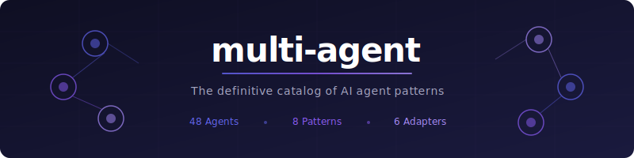
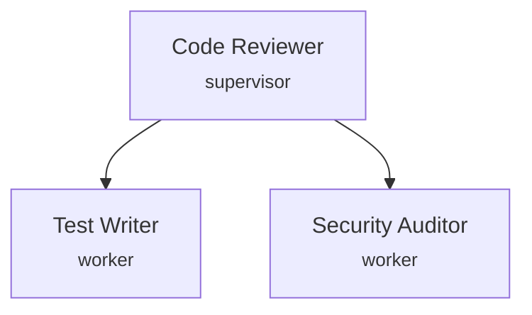
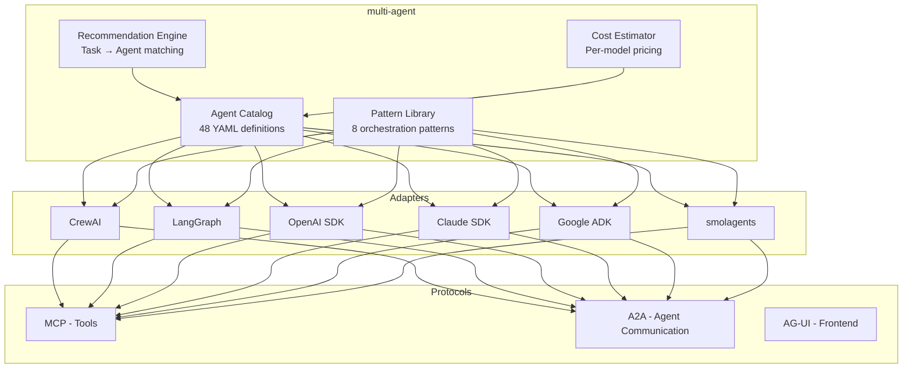

<p align="center">
  <a href="docs/i18n/README.zh-CN.md">简体中文</a> •
  <a href="docs/i18n/README.ja.md">日本語</a> •
  <a href="docs/i18n/README.ko.md">한국어</a> •
  <a href="docs/i18n/README.es.md">Español</a> •
  <a href="docs/i18n/README.de.md">Deutsch</a> •
  <a href="docs/i18n/README.da.md">Dansk</a>
</p>

<p align="center">
  
</p>

<h1 align="center">multi-agent</h1>

<p align="center">
  <strong>The definitive catalog of AI agent patterns. One definition, any framework.</strong>
</p>

<p align="center">
  <a href="https://github.com/Hovborg/multi-agent/blob/main/LICENSE"></a>
  <a href="https://pypi.org/project/multi-agent/"></a>
  <a href="https://github.com/Hovborg/multi-agent/stargazers"></a>
  <a href="https://github.com/Hovborg/multi-agent/actions"></a>
  <a href="https://discord.gg/multiagent"></a>
</p>

<p align="center">
  <a href="#quick-start">Quick Start</a> &bull;
  <a href="#agent-catalog">Agent Catalog</a> &bull;
  <a href="#smart-enhancements">Smart Enhancements</a> &bull;
  <a href="#patterns">Patterns</a> &bull;
  <a href="web/">Playground</a> &bull;
  <a href="docs/">Docs</a> &bull;
  <a href="CONTRIBUTING.md">Contributing</a>
</p>

---

**48 catalog agent definitions. 11 categories. 8 orchestration patterns. 6 framework adapters. 8 export targets. Zero lock-in.**

`multi-agent` is a framework-agnostic catalog of production-ready AI agent patterns. Define your agents once in YAML, run them on CrewAI, LangGraph, OpenAI Agents SDK, Claude SDK, Google ADK, or smolagents.

Stop reinventing agents. Start composing them.

## Why multi-agent?

| | multi-agent | CrewAI | LangGraph | OpenAI SDK | Claude SDK |
|---|:---:|:---:|:---:|:---:|:---:|
| Framework-agnostic definitions | **Yes** | No | No | No | No |
| Export to any AI platform | **Yes** | No | No | No | No |
| Reusable agent catalog | **Yes** | Framework-specific | Framework-specific | Framework-specific | Framework-specific |
| Pattern library (8 patterns) | **Yes** | 2 | 3 | 2 | 2 |
| Built-in cost estimation | **Yes** | No | No | No | No |
| Agent recommendation engine | **Yes** | No | No | No | No |
| Works with any LLM | **Yes** | Yes | Yes | OpenAI only | Claude only |
| MCP native | **Yes** | Partial | Adapter | Yes | Yes |

## Quick Start

```bash
pip install multi-agent
```

### 1. Browse the catalog

```bash
multiagent search "code review"
```

```
Found 3 agents matching "code review":

  code/code-reviewer     Review PRs for bugs, style, and security
  code/test-writer       Generate tests for changed code
  code/refactorer        Suggest and apply refactoring improvements

Recommended pattern: supervisor-worker (1 reviewer + N specialists)
Estimated cost: ~$0.03/review (Claude Haiku) to ~$0.25/review (GPT-4o)
```

### 2. Use an agent definition

```python
from multiagent import Catalog, patterns

# Load agents from the catalog
catalog = Catalog()
reviewer = catalog.load("code/code-reviewer")
test_writer = catalog.load("code/test-writer")

# Compose with a pattern
team = patterns.supervisor_worker(
    supervisor=reviewer,
    workers=[test_writer],
    model="claude-sonnet-4-6"  # or any model
)

result = team.run("Review this PR and write missing tests", context={
    "diff": open("changes.diff").read()
})
```

### 3. Or use with your favorite framework

```python
# CrewAI adapter
from multiagent.adapters import crewai
crew = crewai.from_catalog(["code/code-reviewer", "code/test-writer"])
result = crew.kickoff()

# LangGraph adapter
from multiagent.adapters import langgraph
graph = langgraph.from_catalog(["research/deep-researcher", "research/fact-checker"])
result = graph.invoke({"query": "Latest AI agent frameworks"})

# OpenAI Agents SDK adapter
from multiagent.adapters import openai_sdk
agent = openai_sdk.from_catalog("code/code-reviewer")
result = agent.run("Review this code")
```

### 4. Export to any AI platform

```bash
# Export for Claude Code (.claude/agents subagents)
multiagent export code/code-reviewer claude-code -o .claude/agents

# Export as a portable AgentSkills-style SKILL.md file
multiagent export code/code-reviewer agentskill -o .agents/skills/code-reviewer

# Export as an A2A Agent Card JSON document
multiagent export code/code-reviewer a2a-agent-card -o ./agent-cards

# Export for Codex / OpenClaw (AGENTS.md format)
multiagent export code/code-reviewer codex

# Export for Codex project config (.codex/config.toml snippet)
mkdir -p .codex
multiagent export code/code-reviewer codex-config > .codex/config.toml

# Export for Google Gemini / ADK
multiagent export code/code-reviewer gemini -o ./adk-agents

# Export for ChatGPT (Custom GPT instructions)
multiagent export code/code-reviewer chatgpt

# Export just the system prompt (works with ANY LLM)
multiagent export code/code-reviewer raw

# Bulk export all agents in a category
multiagent export-all claude-code -o .claude/agents -c code
```

| Target | Format | Works With |
|--------|--------|------------|
| `claude-code` | `.md` subagent files | Claude Code `.claude/agents/` |
| `agentskill` | `SKILL.md`-style Markdown | AgentSkills-compatible tools |
| `a2a-agent-card` | Agent Card JSON | A2A discovery via `.well-known/agent-card.json` |
| `codex` | AGENTS.md sections | OpenAI Codex, OpenClaw |
| `codex-config` | `.codex/config.toml` snippet | OpenAI Codex multi-agent roles |
| `gemini` | ADK YAML config | Google Gemini, Vertex AI |
| `chatgpt` | System instructions | ChatGPT, Custom GPTs |
| `raw` | Plain system prompt | **Any LLM** — Ollama, LM Studio, llama.cpp, vLLM, etc. |

### Route before exporting

```bash
# Dry-run agent selection and include export commands for the chosen target
multiagent route "review this PR and write missing tests" --target a2a-agent-card

# Machine-readable route decision with target export plan
multiagent route "review this PR and write missing tests" --target codex-config --json

# Regression-test the built-in routing corpus
multiagent eval-routing --json

# CI-friendly score gates; target hints may evolve faster than agent matching
multiagent eval-routing \
  --min-agent-score 1.0 \
  --min-pattern-score 1.0 \
  --min-target-score 0.95 \
  --min-forbidden-score 1.0 \
  --min-risk-score 1.0 \
  --min-context-score 1.0

# Route directly into a framework-native plan instead of a file export
multiagent route "review this PR and write missing tests" --target openai-agents --json
multiagent route "research three sources with Google ADK" --target adk --json
```

Route JSON includes `risk` and `context` blocks. Use them to gate side effects,
human review, and large context loads before turning a dry-run plan into
execution. See [08 -- Human Review Gates](cookbook/08-human-review-gates.md)
for a concrete policy example.

## Agent Catalog

Every agent is defined in a simple, readable YAML format:

```yaml
# catalog/code/code-reviewer.yaml
name: code-reviewer
version: "1.0"
description: Reviews code changes for bugs, security issues, and style violations
category: code

system_prompt: |
  You are an expert code reviewer. Analyze the provided code changes and identify:
  1. Bugs and logic errors
  2. Security vulnerabilities (OWASP Top 10)
  3. Performance issues
  4. Style and readability improvements
  
  Be specific. Reference line numbers. Suggest fixes.

tools:
  - type: mcp
    server: filesystem
  - type: function
    name: search_codebase
    description: Search for related code in the repository

parameters:
  temperature: 0.1
  max_tokens: 4096

cost_profile:
  tokens_per_run: ~2000
  recommended_model: claude-haiku-4-5  # Best cost/quality for reviews
  estimated_cost_usd: 0.003

works_with:
  - code/test-writer      # Generate tests for flagged code
  - code/refactorer        # Apply suggested improvements
  
recommended_patterns:
  - supervisor-worker      # Reviewer supervises specialist agents
  - sequential             # Review → Test → Refactor pipeline

# Optional schema v2 metadata for routing, safety, observability, and protocols
orchestration:
  control_mode: router
  execution_mode: dry_run
safety:
  side_effect_risk: low
  requires_human_review: true
observability:
  trace_tags: [code-review]
  eval_criteria: [finds-bugs, suggests-fixes]
outputs:
  expected_artifacts: [review-comments]
context:
  loading: trigger
  max_context_tokens: 4096
protocols:
  a2a:
    expose: true
```

### Full Catalog

| Category | Agents | Description |
|----------|--------|-------------|
| **[code/](catalog/code/)** | `code-reviewer` `code-generator` `test-writer` `refactorer` `debugger` `security-auditor` `documentation-writer` `pr-summarizer` | Software development lifecycle |
| **[research/](catalog/research/)** | `deep-researcher` `web-scraper` `fact-checker` `paper-analyst` `competitive-intel` | Research and analysis |
| **[data/](catalog/data/)** | `data-analyst` `sql-generator` `report-writer` | Data engineering and analysis |
| **[devops/](catalog/devops/)** | `ci-cd-agent` `infra-provisioner` `monitoring-agent` `incident-responder` | Infrastructure and operations |
| **[content/](catalog/content/)** | `writer` `editor` `translator` `seo-optimizer` | Content creation pipeline |
| **[finance/](catalog/finance/)** | `trading-analyst` `portfolio-optimizer` `financial-reporter` `fraud-detector` `tax-advisor` | Financial analysis and compliance |
| **[support/](catalog/support/)** | `customer-support` `ticket-router` `knowledge-base-builder` `escalation-agent` | Customer service pipeline |
| **[legal/](catalog/legal/)** | `contract-reviewer` `legal-researcher` `compliance-checker` `document-drafter` | Legal and compliance |
| **[personal/](catalog/personal/)** | `email-assistant` `meeting-scheduler` `note-taker` `task-manager` | Personal productivity |
| **[security/](catalog/security/)** | `vulnerability-scanner` `log-analyzer` `access-reviewer` `incident-analyst` | Security operations |
| **[orchestration/](catalog/orchestration/)** | `task-router` `cost-optimizer` `quality-gate` | Meta-agents for coordination |

## Patterns

Eight battle-tested orchestration patterns, each with runnable examples:

### Pattern Overview

```
                    ┌─────────────┐
                    │  Supervisor  │ ── Pattern 1: Supervisor/Worker
                    └──────┬──────┘    Central agent delegates to specialists
                     ┌─────┼─────┐
                     ▼     ▼     ▼
                   [W1]  [W2]  [W3]

    [A] → [B] → [C]                ── Pattern 2: Sequential Pipeline
                                       Linear chain of specialized agents

    ┌──→ [A] ──┐
    │          │
    ├──→ [B] ──┼──→ [Merge]        ── Pattern 3: Parallel Fan-Out
    │          │                       Independent tasks run concurrently
    └──→ [C] ──┘

    [A] ←──→ [B]                   ── Pattern 4: Reflection/Loop
                                       Iterative refinement between agents

    [A] ──handoff──→ [B] ──handoff──→ [C]  ── Pattern 5: Handoff
                                              Agent transfers full control

    ┌─[A]─┐                        ── Pattern 6: Group Chat
    │ [B] │ ← Selector                Shared conversation, dynamic speaker
    └─[C]─┘

    [A]─┬─[B]                      ── Pattern 7: DAG (Directed Acyclic Graph)
        └─[C]──[D]                    Conditional branching and merging

    ┌Worktree1: [A]┐               ── Pattern 8: Split-and-Merge
    │Worktree2: [B]│→ Git Merge       Isolated parallel work, merged at end
    └Worktree3: [C]┘
```

| Pattern | When to Use | Complexity | Latency | Example |
|---------|------------|:----------:|:-------:|---------|
| [Supervisor/Worker](docs/patterns/supervisor-worker.md) | Complex tasks with clear subtasks | Medium | Medium | Code review team |
| [Sequential](docs/patterns/sequential.md) | Step-by-step processing | Low | High | Content pipeline |
| [Parallel](docs/patterns/parallel.md) | Independent tasks | Low | Low | Multi-source research |
| [Reflection](docs/patterns/reflection.md) | Quality-critical output | Medium | Medium | Legal document drafting |
| [Handoff](docs/patterns/handoff.md) | Escalation and routing | Low | Low | Customer support tiers |
| [Group Chat](docs/patterns/group-chat.md) | Brainstorming, debate | High | High | Design review |
| [DAG](docs/patterns/dag.md) | Complex conditional workflows | High | Variable | CI/CD pipeline |
| [Split-and-Merge](docs/patterns/split-and-merge.md) | Large parallel code changes | Medium | Low | Multi-file refactoring |

## Frameworks

`multi-agent` provides adapter modules for the main Python agent frameworks:

| Framework | Adapter | Current scope |
|-----------|---------|---------------|
| [CrewAI](docs/frameworks/crewai.md) | `multiagent.adapters.crewai` | Agent/Crew conversion; Flow template config |
| [LangGraph](docs/frameworks/langgraph.md) | `multiagent.adapters.langgraph` | Node/flow config conversion |
| [OpenAI Agents SDK](docs/frameworks/openai-sdk.md) | `multiagent.adapters.openai_sdk` | Agent conversion; handoff and agent-as-tool plans |
| [Claude Agent SDK](docs/frameworks/claude-sdk.md) | `multiagent.adapters.claude_sdk` | Message/subagent config conversion |
| [Google ADK](docs/frameworks/google-adk.md) | `multiagent.adapters.google_adk` | ADK config conversion; sequential/parallel workflow plans |
| [smolagents](docs/frameworks/smolagents.md) | `multiagent.adapters.smolagents` | Agent config conversion; manager/managed-agent plans |

Adapter template helpers return plain dictionaries, so they can be inspected,
tested, or translated into framework code before any framework package is
installed:

```python
from multiagent import Catalog
from multiagent.adapters import crewai, google_adk, openai_sdk, smolagents

catalog = Catalog()
reviewer = catalog.load("code/code-reviewer")
test_writer = catalog.load("code/test-writer")

handoff_plan = openai_sdk.to_handoff_config(reviewer, [test_writer])
tool_plan = openai_sdk.to_agent_tool_config(reviewer, [test_writer])
adk_parallel = google_adk.to_workflow_config([reviewer, test_writer], workflow="parallel")
flow = crewai.to_flow_config([reviewer, test_writer], flow_name="CodeReviewFlow", human_feedback=True)
manager = smolagents.to_manager_config(reviewer, [test_writer])
```

The router can also emit framework-native dry-run plans directly:

```bash
multiagent route "review this PR and write missing tests with OpenAI Agents SDK" \
  --target openai-agents \
  --json

multiagent route "research three sources with Google ADK" --target adk --json
multiagent route "build a deterministic CrewAI review flow" --target crewai-flow --json
multiagent route "coordinate workers with smolagents" --target smolagents-manager --json
```

Don't see your framework? [Submit an adapter](CONTRIBUTING.md#adding-an-adapter).

## Protocol Support

Built for the 2026 protocol stack:

| Protocol | Purpose | Support |
|----------|---------|:-------:|
| **[MCP](docs/protocols/mcp.md)** (Model Context Protocol) | Agent ↔ Tool | Native |
| **[A2A](docs/protocols/a2a.md)** (Agent-to-Agent) | Agent ↔ Agent | Native |
| **[AG-UI](docs/protocols/ag-ui.md)** (Agent-to-UI) | Agent ↔ Frontend | Planned |

## Smart Enhancements

Make any agent smarter with research-backed prompt engineering techniques:

```bash
# Enhance with category-tuned profile
multiagent enhance code/code-reviewer

# Apply all 8 techniques
multiagent enhance code/code-reviewer -p all

# Enhance + export to Claude Code
multiagent enhance code/code-reviewer -p all -t claude-code -o .claude/agents
```

| Enhancement | Effect | Source |
|------------|--------|--------|
| `reasoning` | +20% task completion | OpenAI SWE-bench |
| `error_recovery` | 5-level retry hierarchy | Anthropic engineering |
| `verification` | Self-check before output | Claude Code internal |
| `confidence` | -40-60% hallucination | Academic research |
| `tool_discipline` | Faster, fewer errors | OpenAI GPT-5.4 guide |
| `failure_modes` | Avoids 6 anti-patterns | 120+ leaked prompts study |
| `context_management` | Better long-running tasks | LangChain context engineering |
| `information_priority` | Facts over guessing | Manus AI / Anthropic |

```python
from multiagent import Catalog, enhance_agent

catalog = Catalog()
agent = catalog.load("code/code-reviewer")
smart_agent = enhance_agent(agent, profile="all")  # All 8 techniques applied
```

## Agent Composition Visualizer

Auto-generate Mermaid diagrams for agent teams:

```bash
multiagent visualize code/code-reviewer code/test-writer code/security-auditor
```



Try different patterns: `--pattern sequential`, `parallel`, `reflection`, `handoff`, `group-chat`

## Interactive Playground

Browse agents, test enhancements, compare costs, and build teams visually — all in the browser:

**[Open Playground](web/index.html)** (no backend needed — pure static HTML)

- **Agent Catalog** — Search and filter all 48 agents
- **Playground** — Test enhance profiles and export formats live
- **Cost Calculator** — Compare costs across 13 models with monthly estimates
- **Composition Visualizer** — Build teams and auto-generate Mermaid diagrams

Regenerate the static browser data after catalog changes:

```bash
multiagent generate-web-data --output web/catalog-data.js
```

## Cost Estimation

Every agent in the catalog includes cost profiles. Know what you'll spend before you run:

```python
from multiagent import Catalog, CostEstimator

catalog = Catalog()
team = catalog.load_team(["code/code-reviewer", "code/test-writer", "code/refactorer"])

estimate = CostEstimator.estimate(team, input_tokens=5000)
print(estimate)
# CostEstimate(
#   model="claude-haiku-4-5",   total_usd=0.009,  tokens=~8000
#   model="claude-sonnet-4-6",  total_usd=0.045,  tokens=~8000  
#   model="gpt-4o",             total_usd=0.060,  tokens=~8000
# )
```

## Examples

| Example | Pattern | Frameworks | Description |
|---------|---------|------------|-------------|
| [Hello Agents](examples/quickstart/hello_agents.py) | Single | All | Your first agent in 10 lines |
| [Adapter Template Plans](examples/quickstart/demo_adapter_templates.py) | Router/Export prep | OpenAI, ADK, CrewAI, smolagents | Framework plans without optional runtime imports |
| [Code Review Team](examples/real_world/code_review_team.py) | Supervisor/Worker | CrewAI, Claude | Automated PR review pipeline |
| [Research Pipeline](examples/real_world/research_pipeline.py) | Parallel + Sequential | LangGraph | Multi-source research with fact-checking |
| [Content Factory](examples/real_world/content_factory.py) | Sequential | CrewAI | Writer → Editor → SEO → Publisher |
| [Incident Response](examples/real_world/incident_response.py) | DAG | LangGraph | Automated incident triage and remediation |

## Architecture



## Roadmap

- [x] Core catalog format (YAML agent definitions)
- [x] 48 agent definitions across 11 categories
- [x] 8 orchestration patterns with docs
- [x] CrewAI, LangGraph, OpenAI adapters
- [x] Claude SDK, Google ADK adapters
- [x] Cost estimation engine
- [x] CLI tool (`multiagent search`, `multiagent info`, `multiagent compose`)
- [ ] Agent evaluation framework (benchmarks per pattern)
- [ ] Visual agent composer (web UI)
- [ ] Shared team memory integration
- [ ] Agent marketplace (community submissions)
- [ ] AG-UI protocol support
- [ ] Runtime agent governance / permission system

## Contributing

We love contributions! See [CONTRIBUTING.md](CONTRIBUTING.md) for details.

Ways to contribute:
- **Add an agent** — Submit a new YAML agent definition to the catalog
- **Add a pattern** — Document a new orchestration pattern with examples
- **Add an adapter** — Create a framework adapter
- **Improve docs** — Better examples, tutorials, translations
- **Report bugs** — File issues with reproduction steps

## Star History

[](https://star-history.com/#Hovborg/multi-agent&Date)

## License

MIT License — see [LICENSE](LICENSE) for details.

---

<p align="center">
  <sub>If this helps you build better agents, a star would mean a lot.</sub>
</p>
